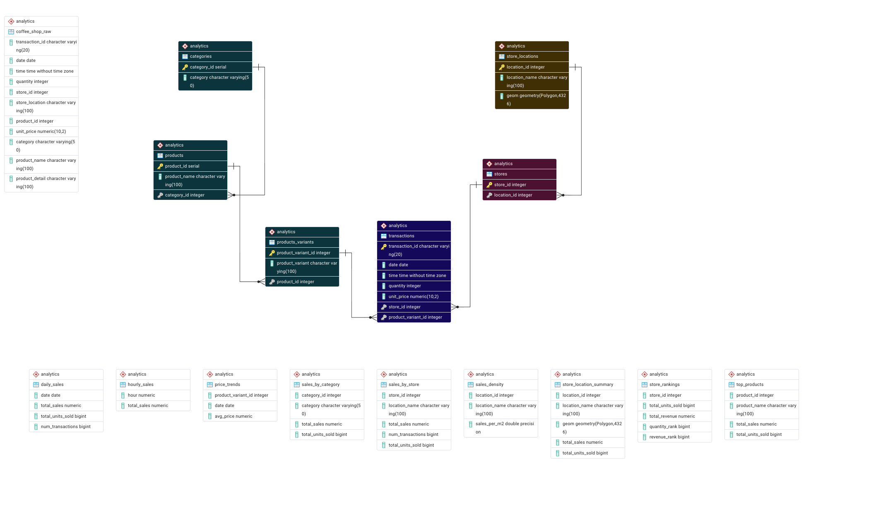

# ☕ NYC Coffee Shop Data Engineering & Analytics

> **Retail Intelligence Pipeline | NYC Coffee Market**
> 
> **Goal:** Transform 149k+ raw transaction records into a 3NF relational database to identify store efficiency.
> 
> **Highlight:** Built an ELT pipeline in **Docker/Postgres**, engineered **PostGIS** spatial density metrics, and implemented **Custom SQL Functions** for performance segmentation. 
> 
> **Result:** Identified **Hell's Kitchen** as the top efficiency performer with a total market revenue of **\$698.8k** over a 6-month interval.

---

## 🛠️ Technical Stack
- **Database:** PostgreSQL 15+ (PostGIS extension enabled)
- **Environment:** Docker & Docker Compose (Containerized workflow)
- **Architecture:** ELT (Extract, Load, Transform) 
- **Tools:** VS Code, pgAdmin4, Git

---

## 📊 Dataset Vital Signs
Based on a formal audit of the `coffee-shop-sales-revenue.csv` (149,116 records), the project baseline is:
*   **Timeframe:** 180-day interval (Jan 1, 2023 – June 30, 2023).
*   **Total Revenue:** \$698,812.33
*   **Units Sold:** 214,470 units
*   **Average Ticket:** \$4.69 revenue per transaction.
*   **Transaction Range:** \$0.80 (Min) to \$360.00 (Max).

---

## 🏗️ Data Architecture & Normalization

### 1. Data Audit & Normalization Logic
Prior to modeling, I performed a deep-dive audit to identify structural inefficiencies and transitive dependencies:
- **Entity Mixing:** The raw data mixed Transaction, Store, and Product entities. I deconstructed these into 6 normalized tables (**3NF**).
- **Price Integrity:** Discovered 15 product variants sold at multiple prices; maintained `unit_price` at the transaction grain to allow for future price elasticity analysis.
- **Integrity:** Confirmed 0% duplicate rate on `transaction_id`.

### 2. The Relational Model (3NF)
The core schema ensures data integrity through PK/FK constraints:

*Architecture Note: The schema moves from the initial denormalized ingestion layer (`coffee_shop_raw`) on the left into a fully normalized 3NF core transactional hub, terminating in an optimized downstream analytical layer (bottom) for rapid metric aggregations and spatial queries.*

- **Fact Table:** `transactions`
- **Dimension Tables:** `stores`, `store_locations` (Spatial), `categories`, `products`, and `product_variants`.

---

## 📈 Analytics & Business Logic

### ⚡ Performance Optimization
- **Indexing Strategy:** Verified via `EXPLAIN ANALYZE`. Implemented **B-Tree** indexes for temporal/categorical queries and **GIST** spatial indexes for geometry lookups.
- **Custom Functions:** Engineered SQL functions (`store_revenue_performance`, `sold_quantity_per_store`) to programmatically classify stores from "Developing" to "Elite."
- **Materialized Views:** Utilized for high-latency spatial calculations, ensuring dashboard-ready query speeds.

### 📍 Spatial & Temporal Insights
- **Spatial Yield:** Leveraged PostGIS `ST_Area` math to calculate `sales_per_km2`, identifying that **Hell's Kitchen** maximizes revenue density more effectively than larger locations.
- **Peak Hour Analysis:** Deconstructed sales by the hour to correlate staffing needs with high-volume morning rushes.
- **Ranking:** Applied SQL Window Functions (`RANK()`) to compare stores by both volume (units) and value (revenue).

---

## 📂 Repository Structure

```text
├── data/               # Raw Kaggle CSVs & Geo-spatial boundaries
├── docs/               # Data Dictionary & ERD Diagrams
├── init/               # DB Setup & Raw Data Ingestion
├── queries/
│   ├── 01_data_audit.sql        # Formal audit & dependency analysis
│   ├── 02_normalization.sql     # 3NF Schema creation & Data Migration
│   ├── 03_views_functions.sql   # Custom segmentation logic & Reporting views
│   ├── 04_analytic_queries.sql  # Complex trend & spatial analysis
│   └── 05_performance_ops.sql   # Indexing & EXPLAIN ANALYZE benchmarks
└── presentation/       # PDF Executive Summary & SQL Analysis visuals (Incoming)
```

---

## 🚀 Getting Started

### Prerequisites
- Docker & Docker Compose installed.

### Installation & Deployment
1. **Clone the repo:**
   ```bash
   git clone https://github.com/Hrz17PMardev/Coffee-Shop.git
   ```
2. **Go to the relevant folder:**
   ```bash
   cd  Coffee-Shop
   ```
3. **Launch the environment:**
   ```bash
   docker-compose up -d
   ```
   *The initialization scripts will automatically run in sequence to build the schema and load the data.*

4. **Access the Data:** Connect your preferred SQL client (pgAdmin4/VS Code) to `localhost:5432`.

---

## 🔄 Roadmap
- [x] **Phase 1:** Relational Database Design & Normalization (SQL).
- [x] **Phase 2:** Spatial Analytics Integration (PostGIS).
- [ ] **Phase 3:** Advanced Statistical Analysis & Z-Score outlier detection (Python/Pandas).
- [ ] **Phase 4:** Interactive Storytelling & Executive Dashboards (Tableau) - **Expected June 2026**.
